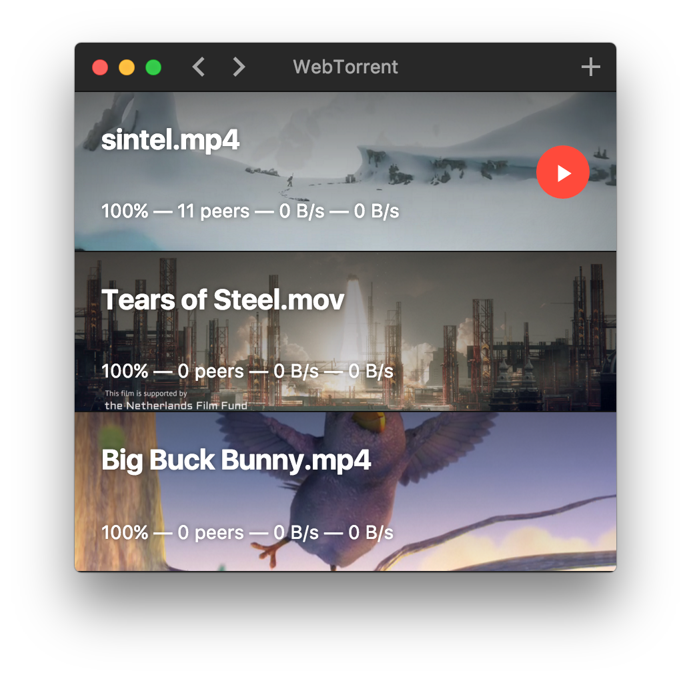

# WebTorrent.app

[![Gitter][webtorrent-gitter-image]][webtorrent-gitter-url]

[webtorrent-gitter-image]: https://img.shields.io/badge/gitter-join%20chat%20%E2%86%92-brightgreen.svg
[webtorrent-gitter-url]: https://gitter.im/feross/webtorrent

#### WebTorrent, the streaming torrent client. For OS X, Windows, and Linux.



## Dev

```
$ npm install
```

### Run

```
$ npm start
```

### Build

```
$ npm run build
```

Builds the app for OS X, Linux, and Windows, using [electron-packager](https://github.com/maxogden/electron-packager).


## License

MIT. Copyright (c) [Feross Aboukhadijeh](http://feross.org).

