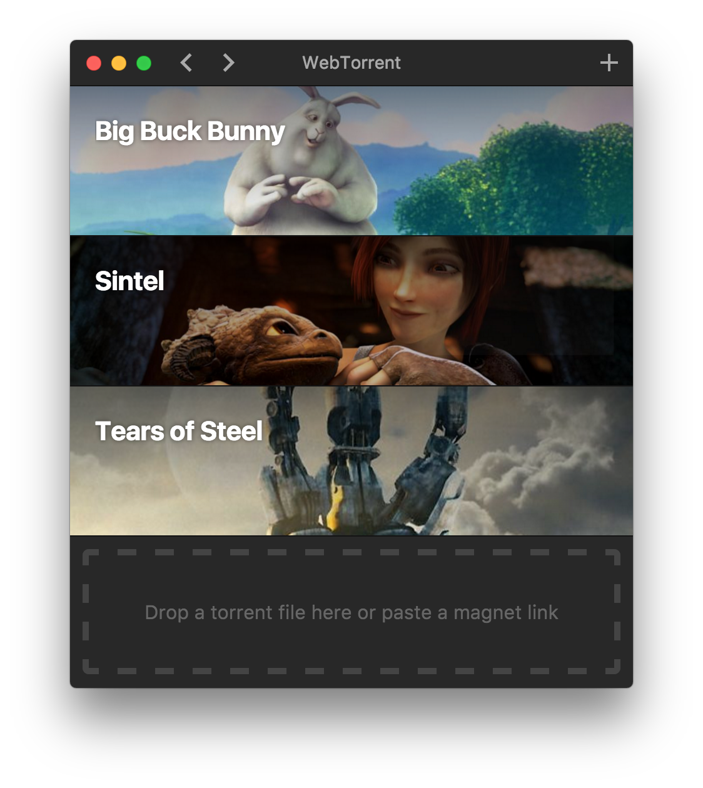

<h1 align="center">
  <br>
  <a href="https://webtorrent.io"></a>
  <br>
  WebTorrent.app
  <br>
  <br>
</h1>

<h4 align="center">The streaming torrent client. For OS X, Windows, and Linux.</h4>

<p align="center">
    <a href="https://gitter.im/feross/webtorrent">
        
    </a>
    <a href="https://travis-ci.org/feross/webtorrent-app">
        
    </a>
    <a href="https://github.com/feross/webtorrent-app/releases">
        
    </a>
</p>

## Install

**WebTorrent.app** is still under very active development. You can download the latest version from the [releases](https://github.com/feross/webtorrent-app/releases) page.

## Screenshot

<p align="center">
  
</p>

## How to Contribute

### Install dependencies

```
$ npm install
```

### Run app

```
$ npm start
```

### Package app

Builds app binaries for OS X, Linux, and Windows.

```
$ npm run package
```

To build for one platform:

```
$ npm run package -- [platform]
```

Where `[platform]` is `darwin`, `linux`, or `win32`.

#### Windows build notes

To package the Windows app from non-Windows platforms, [Wine](https://www.winehq.org/) needs
to be installed.

On OS X, first install [XQuartz](http://www.xquartz.org/), then run:

```
brew install wine
```

(Requires the [Homebrew](http://brew.sh/) package manager.)

### Code Style

[](https://github.com/feross/standard)

## License

MIT. Copyright (c) [Feross Aboukhadijeh](http://feross.org).

